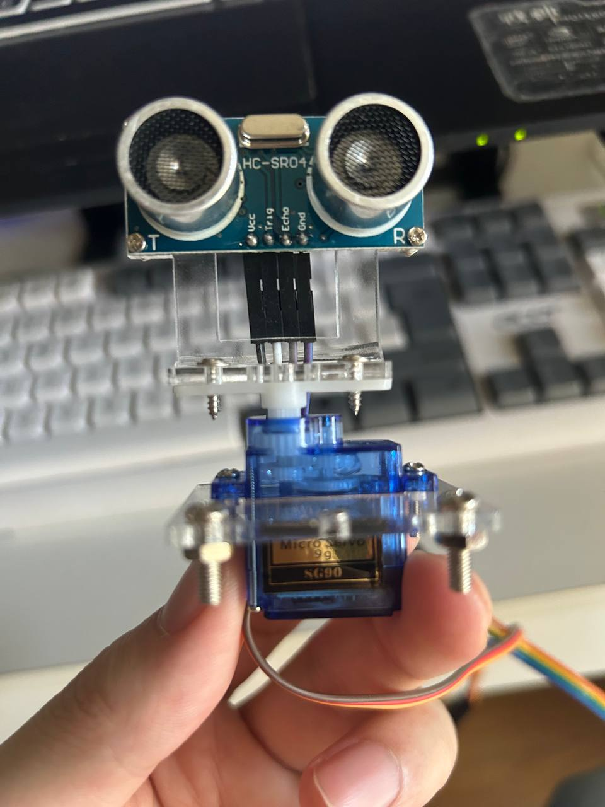
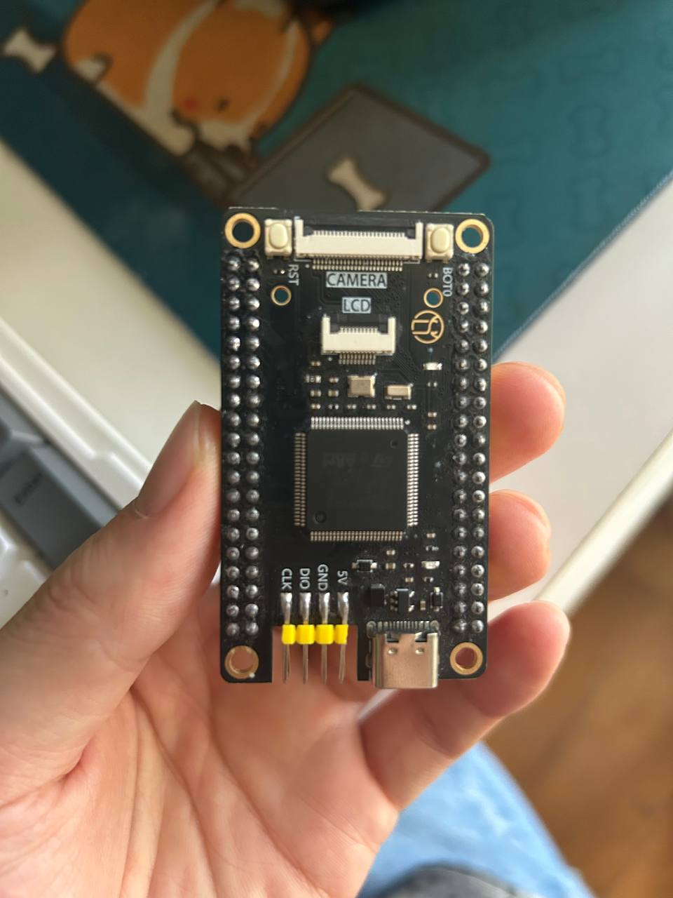

# STM32H743VGTX Projects

This repository contains high-performance embedded projects based on the **STM32H743VGT6** platform (Cortex-M7 @ 480MHz).

To maintain a clean and modular codebase, each feature is developed and maintained in its own dedicated branch. The `master` branch serves as a central navigation hub.
y1

## 📦 Available Branches

### 🔧 driver/sg90-hcsr04

Ultrasonic scanning (radar-like) obstacle avoidance system

* SG90 Servo Motor
* HC-SR04 Ultrasonic Sensor

📥 Clone this branch:

```bash
git clone -b driver/sg90-hcsr04 --single-branch https://github.com/SerDuncanTheTall-zc/stm32H743VGTX.git
```

🎥 youtube Video:
https://youtu.be/yUmKvmhgVbc?si=SUmeEauqsGHOwMXn

🎥 Video: Bilibili
https://www.bilibili.com/video/BV14YAEzWEvY/

---

## 📷 Hardware Setup

<p align="center">
  
  
</p>

---

## 🚀 Future Work

More branches and demos will be added:

* [ ] driver/xxx
* [ ] feature/xxx
* [ ] rtos/xxx

Each branch will include:

* Source code
* Documentation
* Demo video

---

## 👤 Author

zhangchao
